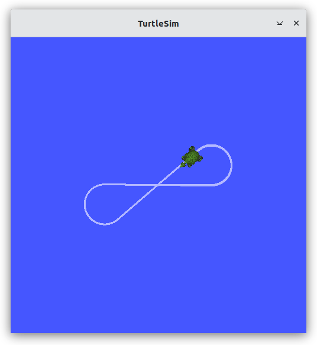
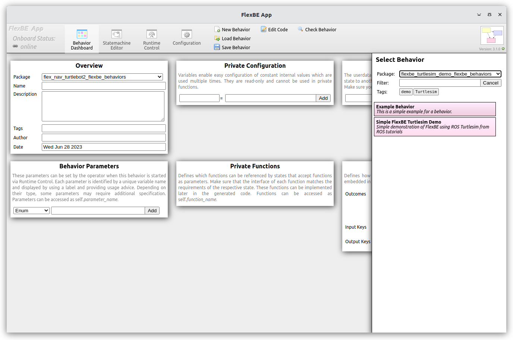
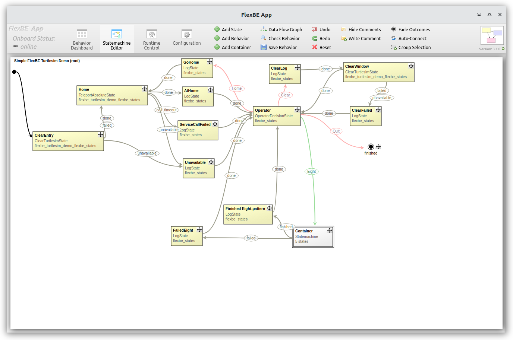
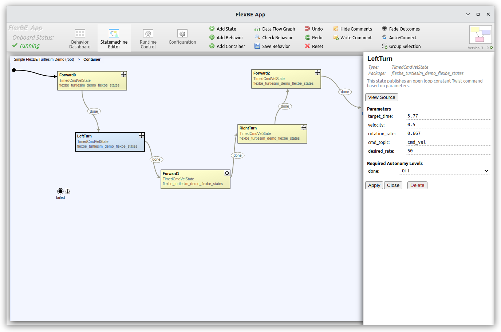
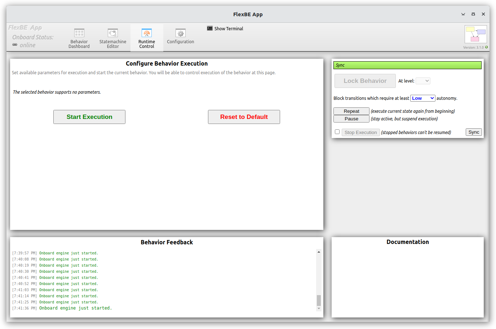
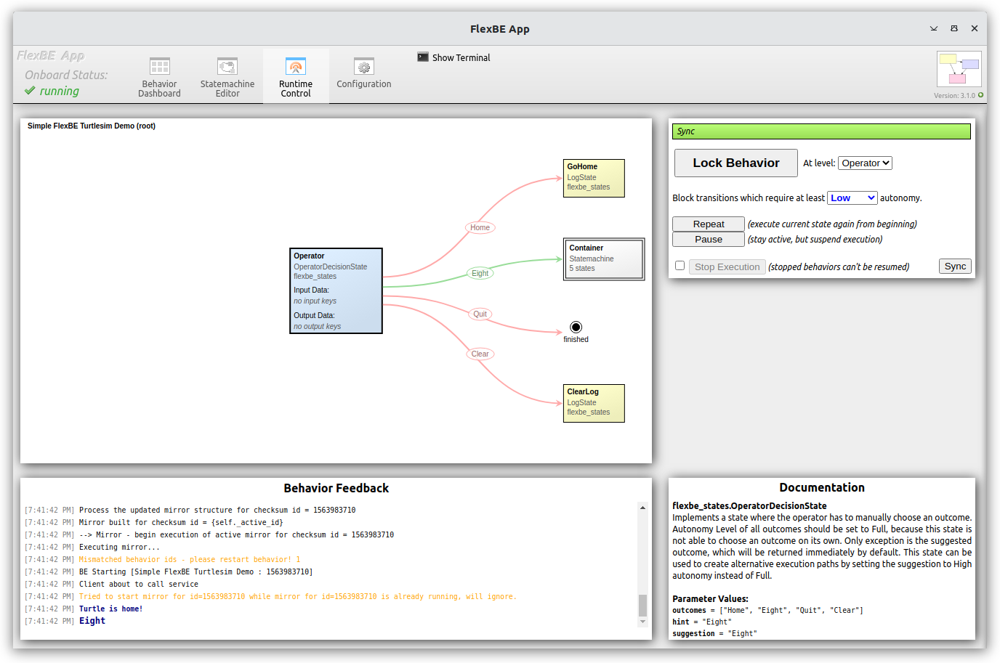
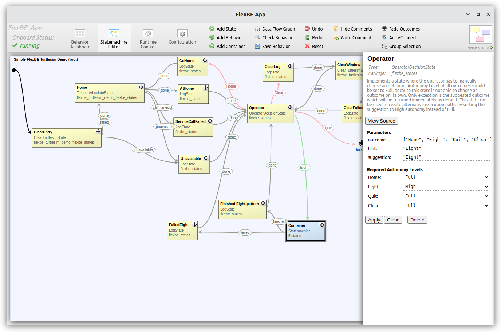
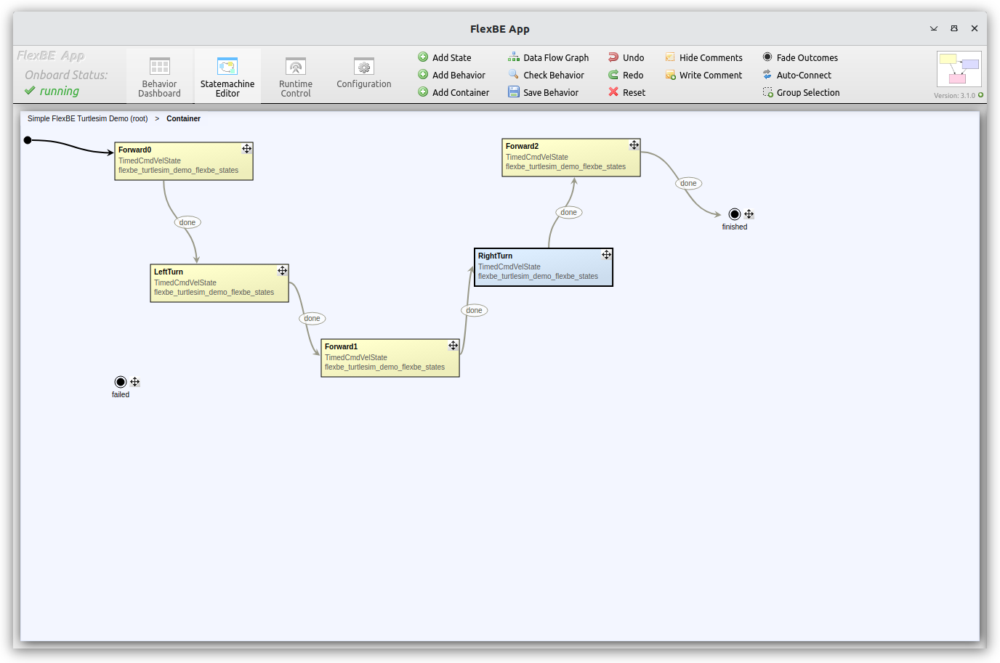

# Flexbe Turtlesim-based Demonstration

This repo provides an introduction to the FlexBE Hierarchical Finite State Machine (HFSM) Behavior Engine.
FlexBE includes both an *Onboard* robot control behavior executive and an
Operator Control Station (*OCS*) for supervisory control and *collaborative autonomy*.

This repo provides a self contained introduction to FlexBE with a
"Quick Start" based on the simple 2D ROS Turtlesim [Turtlesim] simulator.
The repo provides all of the flexbe_turtlesim_demo-specific states and behaviors to provide a simple demonstration of FlexBE's capabilities using a minimal number of the ROS  packages.

In addition to the Turtlesim demonstration, the repo includes several
detailed Example states and behaviors to illustrate the use and capabilities of FlexBE.

----

## Installation

In addition to the standard FlexBE [flexbe_app](https://github.com/flexbe/flexbe_app) and
[flexbe_behavior_engine](https://github.com/flexbe/flexbe_behavior_engine) packages,
clone the following repo into your ROS workspace:

`git clone https://github.com/flexbe/flexbe_turtlesim_demo.git`

Make sure that the branches are consistent (e.g. `git checkout ros2-devel`)
with the corresponding systems.

Install any required dependencies.

  * `rosdep update`
  * `rosdep install --from-paths src --ignore-src`

Build your workspace:

  `colcon build`

After sourcing the new setup as normally required, you must download the required `nwjs` binaries
*before* you can run the FlexBE App:

`ros2 run flexbe_app nwjs_install`

  > Note: These are installed in the `install` folder.  If the `install` folder is deleted, then the `nwjs` binaries
  will need to be reinstalled with this script.

----

For an in-depth discussion of FlexBE capabilities refer to the [Examples](docs/examples.md).

See the main [FlexBE documentation] for more  information about loading and launch behaviors.

----

## Quick Start Usage

Launch the Turtlesim node, FlexBE UI App, and Flexible Behavior engine

For each command, we assume the ROS environment is set up in the terminal using `setup.bash` after a build.

### Autonomous Control Demonstration

Launch TurtleSim:

`ros2 run  turtlesim turtlesim_node`

> Note: Unlike regular simulations such as `Gazebo`, `TurtleSim` does NOT
> publish a `\clock` topic to ROS.  Therefore, do NOT set `use_sim_time:=True` with these demonstrations!
> Without a `clock`, nothing gets published and so the system will appear hung; therefore TurtleSim should
> use the real wallclock time.

Start theFlexBE *Onboard* system using

`ros2 launch flexbe_onboard behavior_onboard.launch.py use_sim_time:=False`

Start a demonstration beahavior in fully autonomous mode

`ros2 run flexbe_widget be_launcher -b "FlexBE Turtlesim Demo" --ros-args --remap name:="behavior_launcher" -p use_sim_time:=False`

  This will launch the `FlexBE Turtlesim Demo`, which will move the turtle through a series of motions to generate
  a figure 8 pattern in full autonomy mode.  
  This example demonstrates using FlexBE to be used to control a system fully autonomously without operator supervision, and serves to
  verify that the installation is working properly.

 > Note: Clicking on any image will give the high resolution view.

 After seeing the system run a few loops, just `Ctrl-C` to end the `behavior_onboard` and `be_launcher` nodes, and move on to the next demos.

----

### FlexBE Collaborative Autonomy Demonstration

Ensure that a `turtlesim` window is open, and if not

`ros2 run  turtlesim turtlesim_node`.

There are 3 approaches to launching the full FlexBE suite for operator supervised autonomy-base control.
Use one (and only one of the approaches):

1) FlexBE Quickstart

`ros2 launch flexbe_app flexbe_full.launch.py use_sim_time:=False`

  This starts all of FlexBE including both the *OCS* and *Onboard* software.

2) Launch the *OCS* and *Onboard* separately:

`ros2 launch flexbe_app flexbe_ocs.launch.py use_sim_time:=False`

`ros2 launch flexbe_onboard behavior_onboard.launch.py use_sim_time:=False`

  This allows running the *Onboard* software *on board* the robot, and the *OCS* software on a separate machine to allow remote supervision.

3) Launch each FlexBE component in separate terminals:
  * *Onboard*

`ros2 launch flexbe_onboard behavior_onboard.launch.py use_sim_time:=False`

  ----
  * *OCS*

`ros2 run flexbe_mirror behavior_mirror_sm --ros-args --remap __node:="behavior_mirror" -p use_sim_time:=False`

`ros2 run flexbe_app run_app --ros-args --remap name:="flexbe_app" -p use_sim_time:=False`

`ros2 run flexbe_widget be_launcher --ros-args --remap name:="behavior_launcher" -p use_sim_time:=False`

`ros2 run flexbe_input input_action_server`

The *OCS* components can be run on a separate computer from the *onboard* components.

#### Controlling Behaviors Via FlexBE User Interface (UI)

Using the FlexBE UI application *Behavior Dashboard*, select *Load Behavior* from the upper middle tool bar, and
select the `flexbe_turtlesim_demo_flexbe_behaviors` package from dropdown, and the `FlexBE Turtlesim Demo`.

The *Statemachine Editor* tab is used to inspect or edit existing behaviors, or build new ones.  
The `FlexBE Turtlesim Demo` behavior is shown above.

The `flexbe_turtlesim_demo_flexbe_states` package includes custom state examples for:

  * `clear_turtlesim_state` - clear the turtlesim window using a *blocking* service call
  * `rotate_turtle_state` - Rotate turtle to user input angle
  * `teleport_absolute_state` - go to designated position using a *non-blocking* service call
  * `timed_cmd_vel_state` - publish command velocity using a specified desired update rate

    > NOTE: The desired state update rate is only best effort.  FlexBE is NOT a real time controller, and
    > is generally suited for lower rate (10s to 100s of Hz) periodic monitoring that does not require precise timing.

FlexBE supports Hierarchical Finite State Machines (HFSM) so that the "TO_DO_FIX_NAME" state is actually a (simple) state machine that executes the figure 8 pattern using the provided FlexBE state implementations
such as the [Timed Cmd Velocity State](flexbe_turtlesim_demo_flexbe_states/flexbe_turtlesim_demo_flexbe_states/timed_cmd_vel_state.py)
which publishes a fixed command velocity as a [Twist](https://docs.ros2.org/latest/api/geometry_msgs/msg/TwistStamped.html) (forward speed and turning rate) for a given time duration.  The specific parameters are set in the FlexBE Editor by clicking on a particular state; the "Left Turn" state values are shown below.

  

The other containers are described in links below.

----

The *Runtime Control* tab allows the operator to launch behaviors on the onboard system, and monitor their execution.

Click on the "Eight" transition to make one loop in the figure 8 pattern.  After completion it will bring you back
to the *Operator Decision* state.  From there you can choose

* ["Home"](docs/home_behavior.md) to recenter your turtle, or
* ["Clear"](docs/clear_behavior.md) to clear the path trace, or
* ["Eight"](docs/eight_loop.md) to do another loop, or
* ["Rotate"](docs/rotate_behavior.md) to allow operator to input a desired angle and pass using FlexBE `userdata`
* ["Pose"](docs/pose_behavior.md) allow operator to input a desired pose
  * position as ('[x, y]') or pose as ('[x, y, angle_in_radians]')
* "Quit" to complete the statemachine behavior and exit the
runtime control.

Clicking on the transition names above will take you to a page detailing that particular sub-behavior.

FlexBE supports variable autonomy levels, so choosing "Full" autonomy allows the system to automatically choose to
repeat the "Eight" transition.

This is based on the settings in the *Operator Decision State*.  By allowing a transition to "Eight" with only "High" autonomy,
setting the executive to "Full" autonomy allows the automatic transition.

----
----

TODO write ups:

 * Discuss FlexBE data flow in context of Turtlesim demo
 * Discuss state implementation details
 * Discuss generated SM code
 * Discussed advanced operations such as "Attaching" to a running behavior.
 * FAQ and debugging help.

----

## Publications

Please use the following publications for reference when using FlexBE:

- Philipp Schillinger, Stefan Kohlbrecher, and Oskar von Stryk, ["Human-Robot Collaborative High-Level Control with Application to Rescue Robotics"](http://dx.doi.org/10.1109/ICRA.2016.7487442), IEEE International Conference on Robotics and Automation (ICRA), Stockholm, Sweden, May 2016.

- Joshua Zutell, David C. Conner and Philipp Schillinger, ["ROS 2-Based Flexible Behavior Engine for Flexible Navigation ,"](http://dx.doi.org/10.1109/SoutheastCon48659.2022.9764047), IEEE SouthEastCon, April 2022.

-----

[Turtlesim]:https://docs.ros.org/en/humble/Tutorials/Beginner-CLI-Tools/Introducing-Turtlesim/Introducing-Turtlesim.html
[FlexBE tutorials]:http://flexbe.github.io
