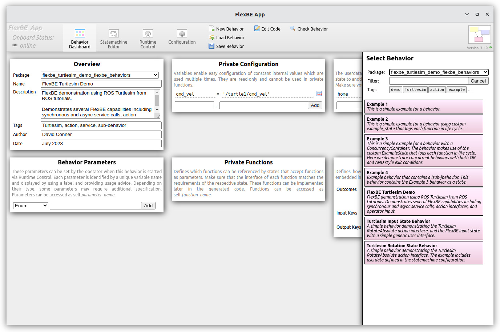
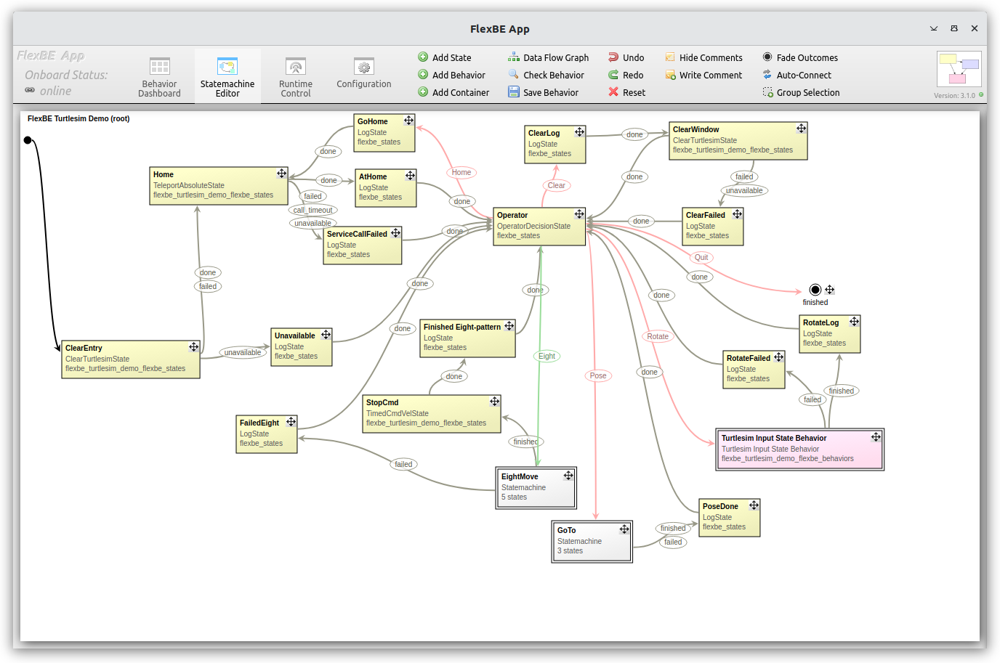
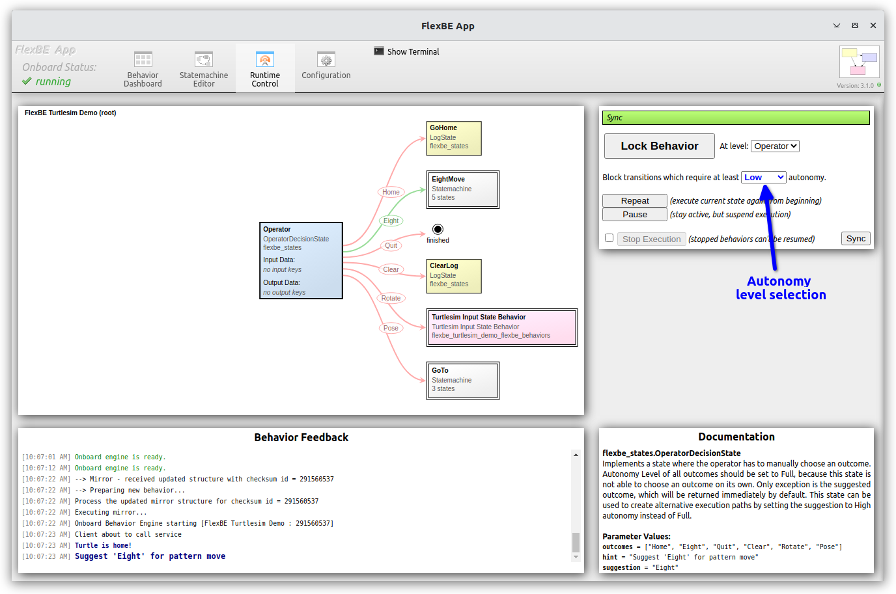
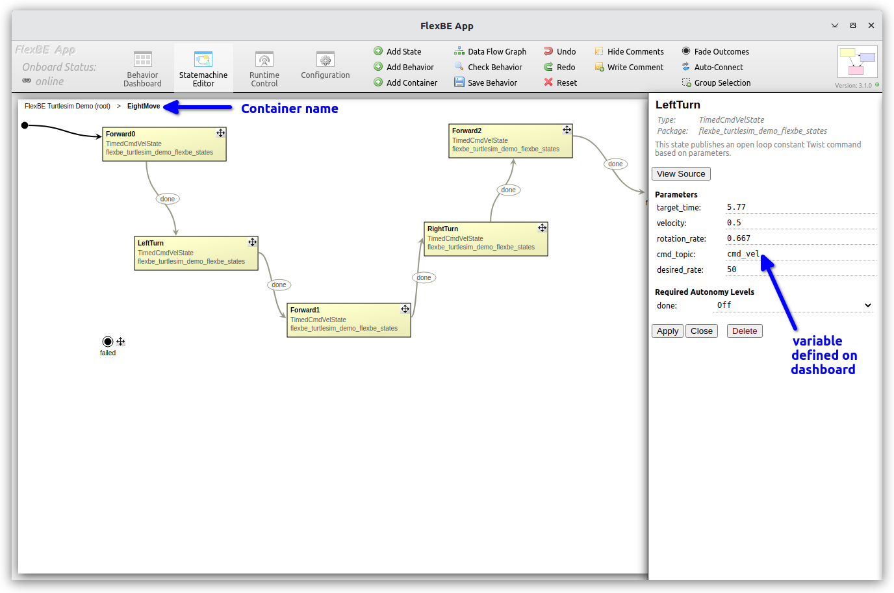
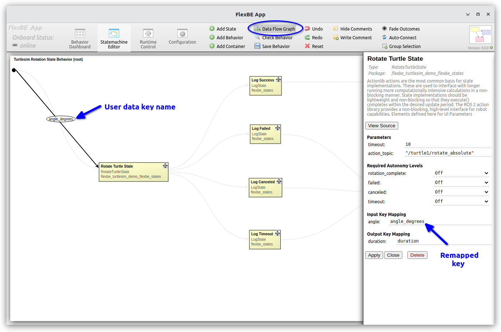
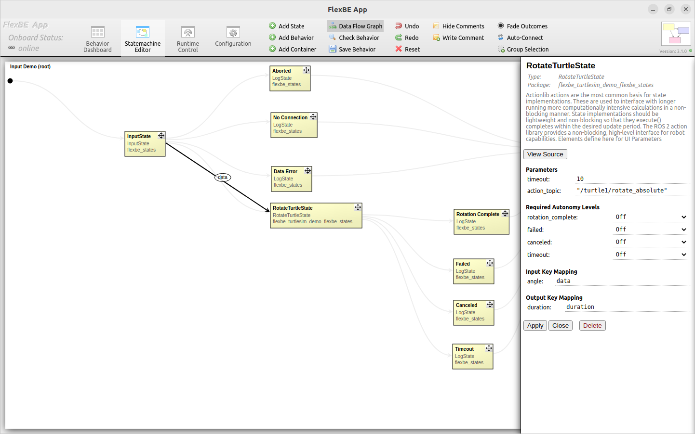

# Flexbe Turtlesim-based Demonstration

This repo provides an introduction to the FlexBE Hierarchical Finite State Machine (HFSM) Behavior Engine.
FlexBE includes both an *Onboard* robot control behavior executive and an
Operator Control Station (*OCS*) for supervisory control and *collaborative autonomy*.

This repro provides a self contained introduction to FlexBE with a
"Quick Start" based on the simple 2D ROS Turtlesim [Turtlesim] simulator.
The repo provides all of the flexbe_turtlesim_demo-specific states and behaviors to provide a simple demonstration of FlexBE using the ROS  packages.

In addition to the Turtle-sim demonstration, the repo includes several
detailed Example states and behaviors to illustrate the use and capabilities of FlexBE.

## Installation

In addition to the standard FlexBE flexbe_app and flexbe_behavior_engine packages,
clone the following repo into your ROS workspace:

    git clone https://github.com/FlexBE/flexbe_turtlesim_demo.git  # if not already present

Make sure that the branches are consistent (e.g. `git checkout ros2-devel`)
with the corresponding systems.

Install any required dependencies.

  * `rosdep update`
  * `rosdep install --from-paths src --ignore-src`

Build your workspace:

  `colcon build`

After sourcing the new setup as normally required, you must download the required `nwjs` binaries
*before* you can run the FlexBE App:

  `ros2 run flexbe_app nwjs_install`

  > Note: These are installed in the `install` folder.  If the `install` folder is deleted, then the `nwjs` binaries
  will need to be reinstalled with this script.

## Quick Start Usage

Launch the Turtlesim node, FlexBE UI App, and Flexible Behavior engine

For each command, we assume the ROS environment is set up in the terminal using `setup.bash` after a build.

First, launch TurtleSim:

`ros2 run  turtlesim turtlesim_node`

> Note: Unlike regular simulations such as `Gazebo`, `TurtleSim` does NOT
> publish a `\clock` topic to ROS.  Therefore, do NOT set `use_sim_time:=True` with these demonstrations!
> Without a `clock`, nothing gets published and so the system will appear hung; therefore TurtleSim should
> use the real wallclock time.

Then start FlexBE using one (and only one) of the follow three blocks:

* FlexBE Quickstart of behaviors with full autonomy

`ros2 launch flexbe_onboard behavior_onboard.launch.py use_sim_time:=False`

`ros2 run flexbe_widget be_launcher -b "Simple FlexBE Turtlesim Demo" --ros-args --remap name:="behavior_launcher" -p use_sim_time:=False`

  This will launch the `Simple FlexBE Turtlesim Demo`, which will move the turtle through a series of motions to generate
  a figure 8 pattern in full autonomy mode.  
  This mode allows FlexBE to be used to control a system fully autonomously without operator supervision.

 > Note: Clicking on any image will give the high resolution view.

----

  For now, just `Ctrl-C` to end the `behavior_onboard` and `be_launcher` nodes, and move on to the next demos.

Ensure that a `turtlesim` window is open via the `ros2 run  turtlesim turtlesim_node`.

There are 3 approaches to launching the full FlexBE suite for operator supervised autonomy-base control.
Use one (and only one of the approaches):

1) FlexBE Quickstart

`ros2 launch flexbe_app flexbe_full.launch.py use_sim_time:=False`

  This starts all of FlexBE including both the *OCS* and *Onboard* software.

2) Launch the *OCS* and *Onboard* separately:

`ros2 launch flexbe_app flexbe_ocs.launch.py use_sim_time:=False`

`ros2 launch flexbe_onboard behavior_onboard.launch.py use_sim_time:=False`

  This allows running the *Onboard* software *on board* the robot, and the *OCS* software on a separate machine.

3) Launch each FlexBE component separately:
  * *Onboard*

  `ros2 launch flexbe_onboard behavior_onboard.launch.py use_sim_time:=False`

  ----
  * *OCS*

  `ros2 run flexbe_mirror behavior_mirror_sm --ros-args --remap __node:="behavior_mirror" -p use_sim_time:=False`

  `ros2 run flexbe_app run_app --ros-args --remap name:="flexbe_app" -p use_sim_time:=False`

  `ros2 run flexbe_widget be_launcher --ros-args --remap name:="behavior_launcher" -p use_sim_time:=False`

The *OCS* components can be run on a separate computer from the *onboard* components.

## Controling Behaviors Via FlexBE UI

Using the FlexBE UI application *Behavior Dashboard*, select *Load Behavior* from the upper middle tool bar, and
select the `flexbe_turtlesim_demo_flexbe_behaviors` package from dropdown, and the `Simple FlexBE Turtlesim Demo`.

The *Statemachine Editor* tab is used to inspect or edit existing behaviors, or build new ones.  
The `Simple FlexBE Turtlesim Demo` behavior is shown above.

The `flexbe_turtlesim_demo_flexbe_states` package includes custom state examples for:

  * `clear_turtlesim_state` - clear the turtlesim window using a *blocking* service call
  * `rotate_turtle_state` - Rotate turtle to user input angle
  * `teleport_absolute_state` - go to home position using a *non-blocking* service call
  * `timed_cmd_vel_state` - publish command velocity using a specified desired update rate

    > NOTE: The desired state update rate is only best effort.  FlexBE is NOT a real time controller, and
    > is generally suited for lower rate (10s to 100s of Hz) periodic monitoring that does not require precise timing.

----

The *Runtime Control* tab allows the operator to launch behaviors on the onboard syste, and monitor their execution.

Click on the "Eight" transition to make one loop in the figure 8 pattern.  After completion it will bring you back
to the *Operator Decision* state.  From there you can choose "Home" to recenter your turtle, or "Clear" to
clear the path trace, or "Eight" to do another loop, or "Quit" to complete the statemachine behavior and exit the
runtime control.

FlexBE supports variable autonomy levels, so choosing "Full" autonomy allows the system to automatically choose to
repeat the "Eight" transition.

This is based on the settings in the *Operator Decision State.  By allowing a transition to "Eight" with only "High" autonomy,
setting the executive to "Full" autonomy allows the automatic transition.

FlexBE supports Hierarchical Finite State Machines (HFSM) so that the "Container" state is actually a (simple) state machine that executes the figure 8 pattern using the provided FlexBE state implementations
such as the [Timed Cmd Velocity State](flexbe_turtlesim_demo_flexbe_states/flexbe_turtlesim_demo_flexbe_states/timed_cmd_vel_state.py)
which publishes a fixed command velocity as a [Twist](https://docs.ros2.org/latest/api/geometry_msgs/msg/TwistStamped.html) (forward speed and turning rate) for a given time duration.  The specific parameters are set in the FlexBE Editor by clicking on a particular state; the "Left Turn" state values are shown below.

----

## RotateTurtleState and userdata

Certain states may require an Input Key Mapping such as the [Rotate Turtle State](flexbe_turtlesim_demo_flexbe_states/flexbe_turtlesim_demo_flexbe_states/rotate_turtle_state.py).
Input keys are defined as part of userdata. The values of these keys can be used by the states to change the result or output of them.
To use the Rotate Turtle State navigate to the behavior dashboard and define a userdata key value under the State Machine Userdata section.
Navigate to the state in the statemachine editor and map the input angle to the userdata key that was defined.
Click on the Data Flow Graph button at the top of the screen to see the flow of data through the state machine.

Now when the state is ran the turtle will rotate to the key value that was defined. While this is great, it would be more useful being able to define an angle while a 
behavior is running.

## InputState

An input key can be supplied to a state while a behavior is running with an Input State. This input state takes user input and maps it to an output key which can be used by other states. In order to utilize the input state an input action server must be run with the following command:

`ros2 run flexbe_input input_action_server`

The action server will prompt a user for input and pass the input to the input state and set the result to an output key. To connect the input state and rotation state map the rotation state input key to the output key of input state.

----

TODO write ups:

 * Discuss FlexBE data flow in context of Turtlesim demo
 * Discuss state implementation details
 * Discuss generated SM code
 * Discussed advanced operations such as "Attaching" to a running behavior.
 * FAQ and debugging help.

----

For a more in-depth discussion of FlexBE capabilities continue to the [Examples](doc/examples.md)

See the main [FlexBE documentation] for more  information about loading and launch behaviors.

----

## Publications

Please use the following publications for reference when using FlexBE:

- Philipp Schillinger, Stefan Kohlbrecher, and Oskar von Stryk, ["Human-Robot Collaborative High-Level Control with Application to Rescue Robotics"](http://dx.doi.org/10.1109/ICRA.2016.7487442), IEEE International Conference on Robotics and Automation (ICRA), Stockholm, Sweden, May 2016.

- Joshua Zutell, David C. Conner and Philipp Schillinger, ["ROS 2-Based Flexible Behavior Engine for Flexible Navigation ,"](http://dx.doi.org/10.1109/SoutheastCon48659.2022.9764047), IEEE SouthEastCon, April 2022.

-----

[Turtlesim]:https://docs.ros.org/en/humble/Tutorials/Beginner-CLI-Tools/Introducing-Turtlesim/Introducing-Turtlesim.html
[FlexBE tutorials]:http://flexbe.github.io
