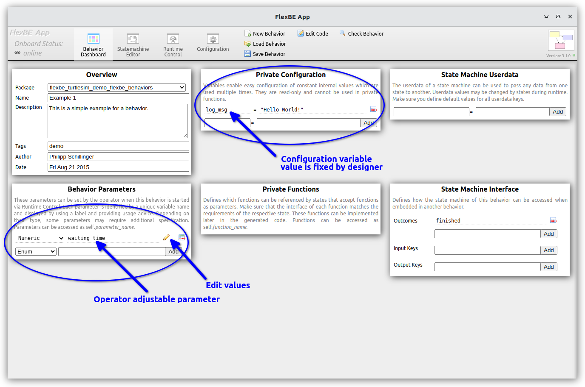

# Example 1 - Simple State Machine using FlexBE states

The first behavior, `Example 1`, constructs a simple state machine
using two states provided with the FlexBE Behavior Engine.

After starting the FlexBE system using either  

`ros2 launch flexbe_app flexbe_full.launch.py use_sim_time:=False`

or the individual components

  `ros2 launch flexbe_onboard behavior_onboard.launch.py use_sim_time:=False`

  `ros2 run flexbe_mirror behavior_mirror_sm --ros-args --remap __node:="behavior_mirror" -p use_sim_time:=False`

  `ros2 run flexbe_app run_app --ros-args --remap name:="flexbe_app" -p use_sim_time:=False`

  `ros2 run flexbe_widget be_launcher --ros-args --remap name:="behavior_launcher" -p use_sim_time:=False`

Load the `Example 1` behavior from the FlexBE UI dashboard.





Example 1 uses a standard FlexBE `LogState`(https://github.com/FlexBE/flexbe_behavior_engine/blob/ros2-devel/flexbe_states/flexbe_states/log_state.py) and a `WaitState`(https://github.com/FlexBE/flexbe_behavior_engine/blob/ros2-devel/flexbe_states/flexbe_states/wait_state.py) state implementation show below.

The log state is one of the simplest FlexBE state implementations.
```python
from flexbe_core import EventState, Logger


class LogState(EventState):
    """
    A state that can log a predefined message.

    Can be used to precisely inform the operator about what happened to the behavior.

    -- text      string  The message to be logged to the terminal.
    -- severity  uint8   Type of logging (Logger.REPORT_INFO / WARN / HINT / ERROR)

    <= done     Indicates that the message has been logged.
    """

    def __init__(self, text, severity=Logger.REPORT_HINT):
        super(LogState, self).__init__(outcomes=['done'])
        self._text = text
        self._severity = severity

    def execute(self, userdata):
        # Already logged. No need to wait for anything.
        return 'done'

    def on_enter(self, userdata):
        """Log upon entering the state."""
        Logger.log(self._text, self._severity)
```

The state implementation is a Python script that provides the
actual execution of the state. In this example, we import the FlexBE Logger class, which is used to which prints
a message in the onboard terminal, the standard FlexBE log file, and on the operators FlexBE UI.


The state implementation must be defined by super classing the [`EventState`]:(https://github.com/FlexBE/flexbe_behavior_engine/blob/ros2-devel/flexbe_core/flexbe_core/core/event_state.py)
class provided by FlexBE in the `flexbe_core` package.

The Python doc-string in the `"""`-marks provides information
about the state, and is used by the UI to display information about the data handling.  Special indicators are used for different data.

* `--` denote parameters defined in the `__init__`
  * In this case `text` and `severity` are specified on construction.
* `<=` denotes possible outcomes of the state
  * In this case, only `done` is a possible outcome
  * This information must match the `outcomes=['done']` specified in the `EventState` `super().__init__` method call.

Although, not shown in this example, other UI specifications include:
* `>#` - data passed as input `userdata` from upstream states
* `<#` - data passed as output `userdata` to downstream states

> Note: Userdata can also be defined at the state machine level.

The `LogState` includes two methods: `on_enter` and `execute`.
The `on_enter` method is called when the state is first entered via a transition.  In this case, the state uses the `Logger`
class to log the data to terminal, log file, and FlexBE UI.

The `execute` method is invoked at a specified rate until is returns something other than `None`.
It is expected (and enforced at run time), that the returned values are as specified as valid (e.g. `done` in this case).
For the `LogState` the execute function immediately returns `done` as there is nothing more to do.

Our second state is the `WaitState`(https://github.com/FlexBE/flexbe_behavior_engine/blob/ros2-devel/flexbe_states/flexbe_states/wait_state.py) state implementation show below.

```Python
from flexbe_core import EventState


class WaitState(EventState):
    """
    Implements a state that can be used to wait on timed process.

    -- wait_time  float  Amount of time to wait in seconds.

    <= done       Indicates that the wait time has elapsed.
    """

    def __init__(self, wait_time):
        super(WaitState, self).__init__(outcomes=['done'])
        self._wait = wait_time

    def execute(self, userdata):
        elapsed = WaitState._node.get_clock().now() - self._start_time
        if elapsed.nanoseconds * 10 ** -9 > self._wait:
            return 'done'

        return None

    def on_enter(self, userdata):
        """Upon entering the state, save the current time and start waiting."""
        self._start_time = WaitState._node.get_clock().now()
```

The `wait_time` parameter says hown long to wait after entering the state before returning.
This provides a simple delay within the state machine.
This state also has only one outcome `done`.

u
Now, start the execution in `Low` autonomy.


