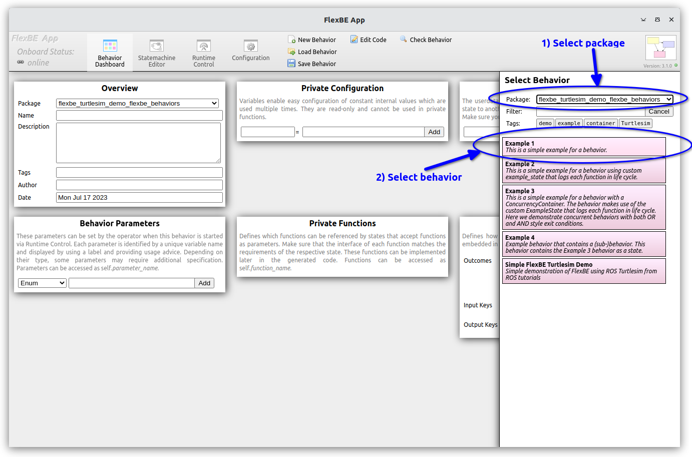
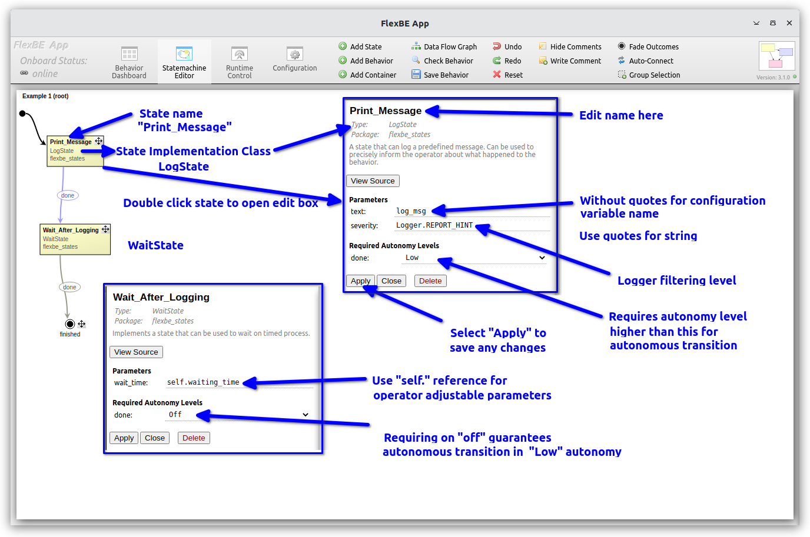
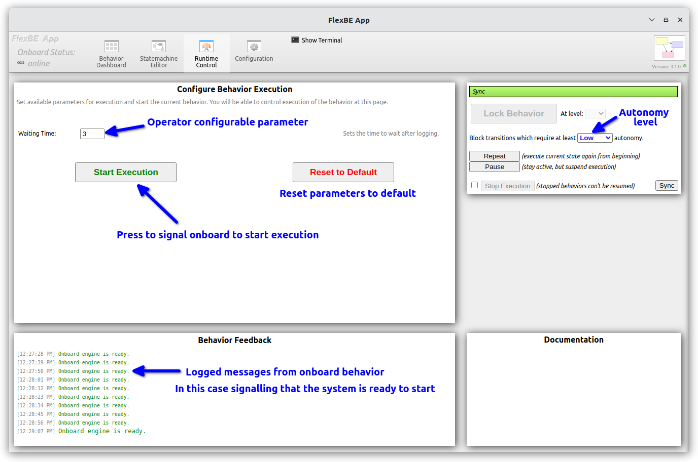
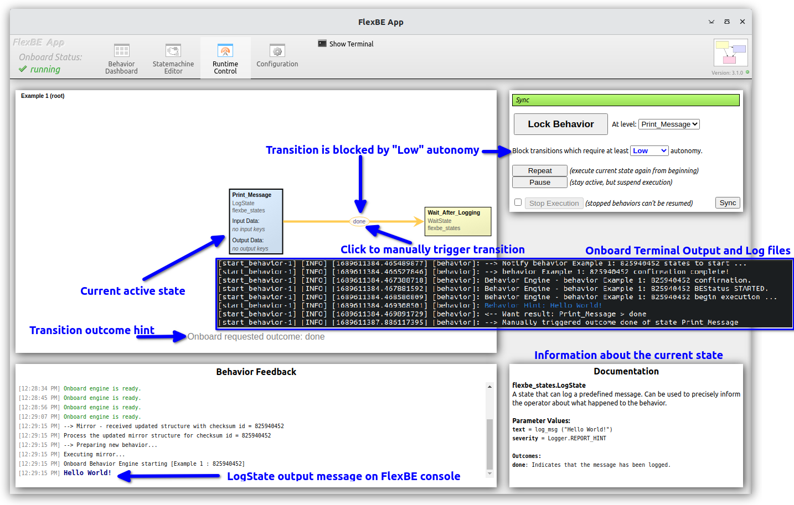

# Example 1 - State Implementations

The first behavior, `Example 1`, constructs a simple state machine
using three states.

After starting the FlexBE system, load the `Example 1`
behavior from the FlexBE UI dashboard.





The example uses a standard FlexBE `LogState`(https://github.com/FlexBE/flexbe_behavior_engine/blob/ros2-devel/flexbe_states/flexbe_states/log_state.py) state implementation show below.

The log state is one of the simplest FlexBE state implementations.
```python
from flexbe_core import EventState, Logger


class LogState(EventState):
    """
    A state that can log a predefined message.

    Can be used to precisely inform the operator about what happened to the behavior.

    -- text      string  The message to be logged to the terminal.
    -- severity  uint8   Type of logging (Logger.REPORT_INFO / WARN / HINT / ERROR)

    <= done     Indicates that the message has been logged.
    """

    def __init__(self, text, severity=Logger.REPORT_HINT):
        super(LogState, self).__init__(outcomes=['done'])
        self._text = text
        self._severity = severity

    def execute(self, userdata):
        # Already logged. No need to wait for anything.
        return 'done'

    def on_enter(self, userdata):
        """Log upon entering the state."""
        Logger.log(self._text, self._severity)
```

The state implementation is a Python script that provides the
actual execution of the state. In this example, we import the FlexBE Logger class, which is used to which prints
a message in the onboard terminal, the standard FlexBE log file, and on the operators FlexBE UI.


The state implementation must be defined by super classing the [`EventState`]:(https://github.com/FlexBE/flexbe_behavior_engine/blob/ros2-devel/flexbe_core/flexbe_core/core/event_state.py)
class provided by FlexBE in the `flexbe_core` package.

The Python doc-string in the `'''`-marks provides information
about the state, and is used by the UI to display information about the data handling.  Special indicators are used for different data.

* `--` denote parameters defined in the `__init__`
  * In this case `text` and `severity` are specified on construction.
* `<=` denotes possible outcomes of the state
  * In this case, only `done` is a possible outcome
  * This information must match the `outcomes=['done']` specified in the `EventState` `super().__init__` method call.

Although, not shown in this example, other UI specifications include:
* `>#` - data passed as input `userdata` from upstream states
* `<#` - data passed as output `userdata` to downstream states

> Note: Userdata can also be defined at the state machine level.

The `LogState` includes two methods: `on_enter` and `execute`.
The `on_enter` method is called when the state is first entered via a transition.  In this case, the state uses the `Logger`
class to log the data to terminal, log file, and FlexBE UI.

The `execute` method is invoked at a specified rate until is returns something other than `None`.
It is expected (and enforced at run time), that the returned values are as specified as valid (e.g. `done` in this case).
For the `LogState` the execute function immediately returns `done` as there is nothing more to do.

Our second state is the `ExampleState` provided as part of this repo.  You are free to develop your own states that inherit from
`EventState`.  To let FlexBE find your states implementations,
write them as a normal ROS 2 installed Python script, and specify
that the package `export`s `<flexbe_states />`.
```xml
<export>
    <build_type>ament_python</build_type>
    <flexbe_states />
</export>
```

Our [`ExampleState`](flexbe_turtlesim_demo_flexbe_states/flexbe_turtlesim_demo_flexbe_states/example_state.py) specifies one parameter (`target_time`) and two outputs (`'done'` and `'failed'`).  
This example does NOT use `userdata`.

```
List parameter values with double hyphens
-- target_time     float     Time which needs to have passed since the behavior started.

List labeled outcomes using the double arrow notation (must match constructor)
<= done            Given time has passed.
<= failed          Example for a failure outcome.
```

These are specified in the `__init__` method, along with needed instance variables.

```python
def __init__(self, target_time):
    """Declare outcomes, input_keys, and output_keys by calling the super constructor with the corresponding arguments."""
    super().__init__(outcomes=['done', 'failed'])

    # Store state parameter for later use.
    self._target_wait_time = Duration(seconds=target_time)

    # The constructor is called when building the state machine, not when actually starting the behavior.
    # Thus, we cannot save the starting time now and will do so later.
    self._state_start_time = None
    self._state_enter_time = None
    self._state_exit_time = None

    self._elapsed_time = Duration(nanoseconds=2**63 - 1)
```
This state is tasked with waiting for the specified time after entering the state before returning done.  This state specifies
two possible outcomes, but only one is actually achievable with this code.  We define other instance attributes to hold data.

The state lifecycle follows:
* `on_start` - the behavior, and all sub-states, is instantiated
  * Use this to initialize things that should be started up
  with the overall behavior.  This method is called after construction, but is separate from the `__init__` construction.

* `on_enter` - the state becomes active after transition
* `execute` - called repeatedly until something other than `None` is returned
  * Each "tic" of the `execute` method is periodic; a desired update tic rate value can be specified at both the state machine level and individual states if so desired. A default rate of 10Hz is used, but the overall desired value is set in the state machine configuration tab (later).

  > Note: The tic rate is "best effort"; there are no real time performance guarantees.
* `on_exit` is called once when the state returns something other than `None` from `execute`.
* `on_stop` is called when the behavior is shutdown.

Only an `execute` function is required to be overridden so that
the state can return a value an terminate the state operation.
The other methods can be overridden, or left as their default `pass` values.  Only `enter` should return a value other than `None`.

The [`ExampleState`](flexbe_turtlesim_demo_flexbe_states/flexbe_turtlesim_demo_flexbe_states/example_state.py) overrides all of the methods, and adds logging
to each transition to show how the system works.

```Python
def on_enter(self, userdata):
    self._state_enter_time = ExampleState._node.get_clock().now()
    self._elapsed_time = Duration(seconds=0.0)
    self._return = None  # Clear return code on entry

    Logger.loginfo(f"on_enter for '{self._name}' state ({self.path}) @ {self.clock_time} "
                       f"- need to wait for {self.target_seconds} seconds.")

def on_exit(self, userdata):
    self._state_exit_time = ExampleState._node.get_clock().now()
    Logger.loginfo(f"on_exit for '{self._name}' state ({self.path}) @ {self.clock_time} "
                   f"elapsed time = {self.elapsed_seconds} seconds.")

def on_start(self):
    self._state_start_time = ExampleState._node.get_clock().now()
    Logger.loginfo(f"on_start for '{self._name}' state ({self.path}) @ {self.start_time} seconds "
                   f" time to wait = {self.target_seconds} seconds..")

def on_stop(self):
    self._elapsed_time = ExampleState._node.get_clock().now() - self._state_start_time
    Logger.loginfo(f"on_stop for '{self._name}' state ({self.path}) @ {self.clock_time} seconds "
                   f" total behavior instance elapsed time = {self.elapsed_seconds} seconds ")
    if self._state_enter_time is None:
        Logger.loginfo(f"on_stop for '{self._name}' state ({self.path}) @ {self.clock_time} seconds "
                   f" - never entered the state to execute! ")
    else:
        try:
            self._elapsed_time = self._state_exit_time - self._state_enter_time
            Logger.loginfo(f"    '{self._name}' state "
                        f"was active (enter-to-exit) for {self.elapsed_seconds} seconds.")
        except Exception as exc:  # pylint: disable=W0703
            Logger.logerr(f"  entered at time={self.enter_time} seconds but never exited!")
```

In this particular example state, we have provided several
helper property methods to assist in data logging:

```Python
@property
def elapsed_seconds(self):
    return f"{self._elapsed_time.nanoseconds/S_TO_NS:.3f}"

@property
def target_seconds(self):
    return f"{self._target_wait_time.nanoseconds/S_TO_NS:.3f}"

@property
def start_time(self):
    return f"{self._state_start_time.nanoseconds/S_TO_NS:.3f}"

@property
def enter_time(self):
    return f"{self._state_enter_time.nanoseconds/S_TO_NS:.3f}"

@property
def exit_time(self):
    return f"{self._state_exit_time.nanoseconds/S_TO_NS:.3f}"

@property
def clock_time(self):
    time_msg = self._node.get_clock().now().to_msg()
    time = time_msg.sec % 3600 + time_msg.nanosec/S_TO_NS
    return f"{time:.3f}"
```

A few key points:
* The `EventState` super class maintains a reference to the ROS `node`.  Here we use the `_node` attribute get the ROS clock instance.
* Normal Python constructs including `for`-loops, `if-else`, and
`try-except` blocks are valid within these methods.
  * With a few caveats:
    * Only `execute` should return a value
    * These should not be long `blocking` calls.  

    > Note: While possible, prefer to use non-blocking calls such as `actions` or asychronous service calls.  
    See the [TurtleSim Deep Dive](docs/turtlesim_deep_dive.md) for more information about action and service handling.

    * States should be fast acting "reactive" states.
      * Offload longer running processes, such as planning, to separate nodes and preferably interface using regular `topics` and `actions`

The [`ExampleState`](flexbe_turtlesim_demo_flexbe_states/flexbe_turtlesim_demo_flexbe_states/example_state.py) `execute` function monitors the time since `on_enter`, and returns `done` when the *approximate* time has elapsed based on the designated update rate.

```Python
def execute(self, userdata):
    """
    Execute this method periodically while the state is active.

    Main purpose is to check state conditions and trigger a corresponding outcome.
    If no outcome is returned, the state will stay active.
    """
    if self._return is not None:
        # We must be blocked by autonomy level.
        # Here we will just return the prior outcome and not recalculate

        # Local info is NOT sent to the UI, and only shown in logs and terminal
        Logger.localinfo(f"execute blocked for '{self._name}' state ({self.path}) @ {self.clock_time} "
                    f"- use prior return code={self._return}")
        return self._return

    # Normal calculation block
    try:
        self._elapsed_time = ExampleState._node.get_clock().now() - self._state_enter_time
        if self._elapsed_time >= self._target_wait_time:
            Logger.loginfo(f"execute for '{self._name}' state ({self.path}) @ {self.clock_time} "
                           f"- done waiting at {self.elapsed_seconds} seconds.")
            self._return = 'done'
            return 'done'  # One of the outcomes declared above.
    except Exception:  # pylint:disable=W0703
        # Something went wrong
        Logger.logerr(f"execute for '{self._name}' state ({self.path}) @ {self.clock_time} "
                       f"- something went wrong after {self.elapsed_seconds} seconds.")
        self._return = 'failed'
        return 'failed'

    # Local info is NOT sent to the UI, and only shown in logs and terminal
    Logger.localinfo(f"execute for '{self._name}' state ({self.path}) @ {self.clock_time} "
                    f"- {self.elapsed_seconds} seconds since start.")
    return None  # This is normal behavior for state to continue executing
```

A few key points.  
* We track any previous `_return` value in case the operator has the exit transition blocked due to an autonomy
level.  
If the transition is blocked, the state continues to execute.  
So, the state designer can choose to execute, or just return
the previous value depending on the specific implementation
 design.  This flexibility is left to the state developer.  
But, be aware that the the `execute` is called if a transition is blocked.
We will guide you through this later in the example demonstration.
* This example includes a significant amount of logging; this is
atypical, especially in an execute block.
* The code demonstrates one possible use of exception handling and returning a `failed` outcome,
although we do not expect this to be exercised in this example.

Now, start the execution in `Low` autonomy.



